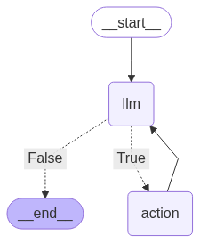

# Simple langgraph chatbot
A Streamlit-powered chatbot demo using LangGraph, LangChain, and OpenAI. Features agent memory, tool integration (Tavily search), and session management for interactive research and assistant tasks.

## Features

- **Streamlit UI**: Chat interface with session history and sidebar for system prompt customization.
- **LangGraph Agent**: Uses LangGraph for agent state management and memory.
- **Tool Integration**: Includes Tavily search tool for web queries.
- **Session Management**: Each chat session is tracked with a unique ID.
- **Agent Memory Visualization**: Sidebar displays agent state transition diagram (`agent_with_memory.png`).

## Access the App

You can try the chatbot directly at:  
**[https://simple-langgraph-chatbot.streamlit.app/](https://simple-langgraph-chatbot.streamlit.app/)**

## Setup

1. **Clone the repository**:
    ```
    git clone https://github.com/yourusername/simple-langgraph-chatbot.git
    cd simple-langgraph-chatbot
    ```

2. **Install dependencies**:
    ```
    pip install -r requirements.txt
    ```

3. **Configure secrets**:
    - Add your OpenAI and Tavily API keys to `.streamlit/secrets.toml`:
      ```
      [LLM]
      API_KEY = "your-openai-api-key"
      MODEL = "gpt-4o"

      [TAVILY]
      API_KEY = "your-tavily-api-key"
      ```

4. **Run the app**:
    ```
    streamlit run app.py
    ```

## File Overview

- `app.py`: Main Streamlit app.
- `agent_helper.py`: Defines the agent logic and LangGraph workflow.
- `agent_with_memory.png`: Diagram of agent state transitions.
- `README.md`: Project documentation.

## Agent



